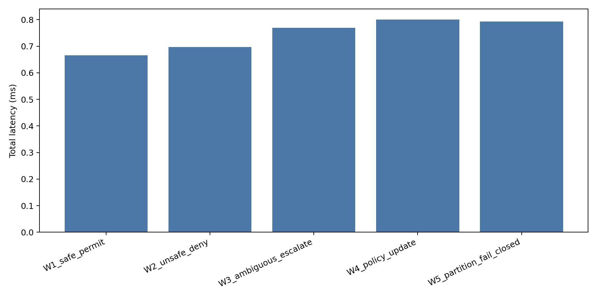
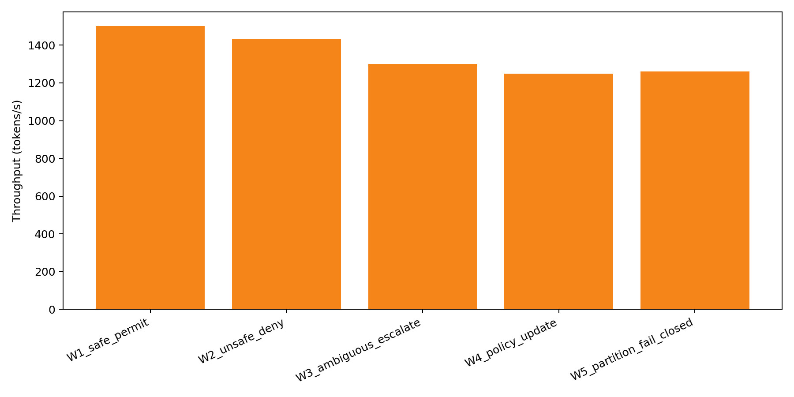

# Ethical Hyper-Velocity (EHV) Runtime

[](https://arxiv.org/abs/2605.17909)
[](#)

> A Hardware-Rooted Zero-Trust Runtime Enforcement Architecture for Agentic AI Systems

**Author:** Riddhi Mohan Sharma
**Affiliation:** Independent Researcher, AI Governance &
Healthcare Informatics | Columbia University EPM
**Website:** [riddhimohan.com](https://www.riddhimohan.com)

---

## 📄 Paper

"Ethical Hyper-Velocity (EHV): A Hardware-Rooted Zero-Trust Runtime Enforcement Architecture for Agentic AI Systems"

- arXiv: [arXiv:2605.17909 \[cs.AI\]](https://arxiv.org/abs/2605.17909) (or `arXiv:2605.17909v2 [cs.AI]` for this version)
- DOI: [10.48550/arXiv.2605.17909](https://doi.org/10.48550/arXiv.2605.17909)
- Blog: [riddhimohan.com/blog/ethical-hyper-velocity-ehv-governance-framework](https://www.riddhimohan.com/blog/ethical-hyper-velocity-ehv-governance-framework)

---

## 🔑 Key Contributions

- **SMFD** — Sub-millisecond Formal Constraints: GL → 0
  asymptotically, bounded by O(1) TEE attestation overhead
- **Policy Enforcement Invariant** — G(a,C) ∈ {PERMIT, DENY,
  ESCALATE} via hardware-rooted cryptographic attestation
- **CRDT Causal Sync** — Monotonic causal policy store via
  vector clocks mitigating clock-skew attacks (T7)
- **Grammar-Constrained Decoding (GCD)** — Pre-execution logit
  masking to enforce syntactic compliance at the token level
- **Tiered FSDM** — Fail-Safe Degraded Mode across 3
  clinical severity tiers (NIST SP 800-53 SI-17 aligned)
- **Velocity-Ethics Co-Production** — ∂V/∂I ≥ 0, a sign
  reversal from all existing framework assumptions

---

## 📐 TLA+ Formal Specification

The core safety guarantees of the EHV architecture are formally specified in TLA+:
- **Specification File**: [`EHV.tla`](EHV.tla) (and [`EHV.cfg`](EHV.cfg))
- **Model Checking**: Evaluated using the TLC Model Checker to a depth of 8, exploring 1,738 states (324 distinct states found) with 0 safety or liveness violations.
- **Safety Invariant**: Enforces that no unsafe agentic action can reach a `PERMIT` state under any asynchronous scheduler, network partition, or concurrent update interleaving.

---

## 🏗️ Repository Structure

This repository provides the reference proof-of-concept Python runtime implementing the EHV JIT-PEP enforcement pipeline:

- **[`ehv/`](ehv/)**: Reference implementation packages.
  - **[`ehv/compiler/engine.py`](ehv/compiler/engine.py)**: The JIT Policy Enforcement Point (PEP) decorator enforcer.
  - **[`ehv/gcd/`](ehv/gcd/)**: Grammar-Constrained Decoding (GCD) module (DFA + LogitsMasker).
  - **[`ehv/sync/store.py`](ehv/sync/store.py)**: Conflict-free Replicated Data Type (CRDT) policy store (LWW + Causal).
  - **[`ehv/sync/vclock.py`](ehv/sync/vclock.py)**: Vector clock for causal policy ordering.
  - **[`ehv/identity/`](ehv/identity/)**: SPIFFE/SPIRE workload identity stub.
  - **[`ehv/enclave/enclave.py`](ehv/enclave/enclave.py)**: Simulated Trusted Execution Environment (TEE) for attestation caching.
- **[`bench/`](bench/)**: Reproducible SEV-SNP benchmark suite and execution latency harness.
- **[`examples/`](examples/)**: Clinical dosage validation case studies, latency benchmarks, and Anthropic API red-teaming/prompt-injection defense examples.
- **[`tests/`](tests/)**: Exhaustive pytest unit test suite confirming SMFD, epoch attestation, and fail-closed partition semantics.
- **[`EHV.tla`](EHV.tla)**: TLA+ formal specification of the EHV state machine.

---

## 🚀 Quick Start

### 1. Installation
```bash
git clone https://github.com/riddhimohansharma/ehv-runtime.git
cd ehv-runtime
```

### 2. Run the Demos
Run the GCD Clinical Dosage Demo:
```bash
python examples/gcd_dosage.py
```

Run the Anthropic Claude Red-Teaming & Prompt Injection defense harness:
```bash
python examples/anthropic_redteam.py
```

### 3. Verify Performance (SMFD Benchmarks)
Run the benchmark harness to generate latency and throughput projections.
```bash
pip install pandas matplotlib
python bench/sev_snp_benchmark.py
python bench/measure_enforcement.py
```

### 4. Visual Performance Projections
Simulated latency and throughput profiles on AMD SEV-SNP:




---

## 📂 Repository Roadmap

- [x] **Enforcement Pattern**: Decorator-based PEP + Causal CRDT Policy Store.
- [x] **Grammar-Constrained Decoding (GCD)**: Token-level logits masking DFA engine.
- [x] **OSCAL GBOM Export**: NIST OSCAL v1.1.2 compliance-as-code schema.
- [x] **Formal Verification**: TLA+ specification verified with TLC to depth 8.
- [ ] **Hardware Root**: Integration with physical Intel TDX / AMD SEV-SNP.
- [x] **LLM/API Integration**: PEP wrapping Anthropic API calls with prompt injection/jailbreak defense.

---

## 📚 Research & References

- arXiv Preprint: [arXiv:2605.17909](https://arxiv.org/abs/2605.17909)
- **[Verification Report](REPORT.md)**: View the latest empirical benchmarks.
- **[TLA+ Specification](EHV.tla)**: Inspect the formal safety proofs.
- **[Limitations & Scoping](LIMITATIONS.md)**: Detailed breakdown of PoC vs. full architecture.

---

## 📊 GL Reduction Model

| Architecture | GL | Reduction |
|---|---|---|
| ISO 42001 PDCA | ~2×10⁹ ms | Baseline |
| NIST AI RMF | ~3×10⁸ ms | ~85% |
| EHV Transitional | <60,000 ms | ~99.997% |
| EHV Full (TLA+) | O(1) bounded | ~100% |

---

## 📜 Citation

```bibtex
@misc{sharma2026ehv,
  title={Ethical Hyper-Velocity (EHV): A Hardware-Rooted
         Zero-Trust Runtime Enforcement Architecture for Agentic AI Systems},
  author={Sharma, Riddhi Mohan},
  year={2026},
  eprint={2605.17909},
  archivePrefix={arXiv},
  primaryClass={cs.AI},
  doi={10.48550/arXiv.2605.17909},
  url={https://arxiv.org/abs/2605.17909}
}
```

---

## 🔖 License

CC BY 4.0 — You may share and adapt with attribution.

---
*Developed by Riddhi Mohan Sharma | [riddhimohan.com](https://riddhimohan.com)*
